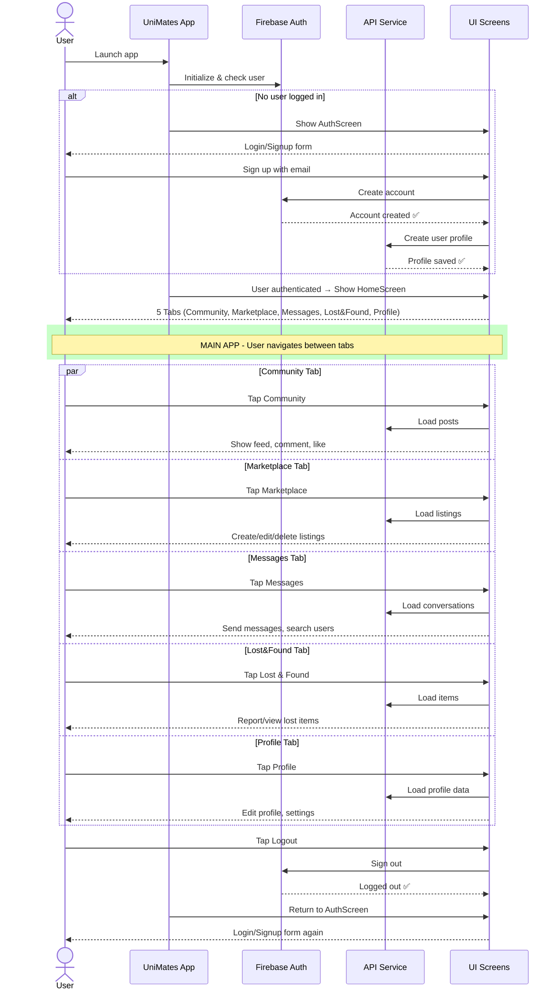

# UniMates App - Simplified Full Application Flow

## Complete App Flow (High-Level)


    
    alt No user logged in
        App->>UI: Show AuthScreen
        UI-->>User: Login/Signup form
        User->>UI: Sign up with email
        UI->>Firebase: Create account
        Firebase-->>UI: Account created ✅
        UI->>API: Create user profile
        API-->>UI: Profile saved ✅
    end
    
    App->>UI: User authenticated → Show HomeScreen
    UI-->>User: 5 Tabs (Community, Marketplace, Messages, Lost&Found, Profile)

    rect rgb(200, 255, 200)
    note over User,UI: MAIN APP - User navigates between tabs
    end

    par Community Tab
        User->>UI: Tap Community
        UI->>API: Load posts
        UI-->>User: Show feed, comment, like
    and Marketplace Tab
        User->>UI: Tap Marketplace
        UI->>API: Load listings
        UI-->>User: Create/edit/delete listings
    and Messages Tab
        User->>UI: Tap Messages
        UI->>API: Load conversations
        UI-->>User: Send messages, search users
    and Lost&Found Tab
        User->>UI: Tap Lost & Found
        UI->>API: Load items
        UI-->>User: Report/view lost items
    and Profile Tab
        User->>UI: Tap Profile
        UI->>API: Load profile data
        UI-->>User: Edit profile, settings
    end

    User->>UI: Tap Logout
    UI->>Firebase: Sign out
    Firebase-->>UI: Logged out ✅
    App->>UI: Return to AuthScreen
    UI-->>User: Login/Signup form again
```

---

## What This Diagram Shows

| Step | Description |
|------|-------------|
| **1. Launch** | User opens UniMates app |
| **2. Auth Check** | Firebase checks if user is logged in |
| **3. Login** | If no user, show login screen and handle signup |
| **4. Main App** | After login, show 5 tabs (parallel blocks show all available options) |
| **5. Each Tab** | Brief description of what each tab does |
| **6. Logout** | Return to login screen |

---

## Key Differences from Detailed Diagram

✅ **Removed all individual user actions** (typing, form fills, etc)  
✅ **One-line summaries per tab** instead of full flows  
✅ **Parallel blocks** show tabs are all accessible  
✅ **Auth flow simplified** with `alt` (if/else) block  
✅ **Total lines: 50** instead of 250  

---

## How to View

**Mermaid Live Editor:** https://mermaid.live
1. Copy the code block above
2. Paste into editor
3. See diagram render instantly
4. Export as PNG


---

## App Flow Overview

### 1. **Launch & Authentication** (5 steps)
- User launches app
- Firebase checks if logged in
- If not: Show login screen, create account, save profile
- User authenticated → Show HomeScreen

### 2. **Main Navigation** (Parallel - User can tap any tab)
- **Community Tab** - View posts, comment, like
- **Marketplace Tab** - Browse/create/edit listings  
- **Messages Tab** - Send messages, search users
- **Lost & Found Tab** - Report/view lost items
- **Profile Tab** - Edit profile, settings

### 3. **Logout**
- Tap logout → Sign out from Firebase
- Return to AuthScreen

---

## Diagram Benefits

✅ **Clean & Simple** - Easy to understand at a glance  
✅ **Shows all 5 tabs** - Available from main screen  
✅ **High-level flow** - Main interactions only  
✅ **Easy to present** - Perfect for stakeholders/reports  

---

## How to View Online

**Mermaid Live Editor:** https://mermaid.live
1. Copy the code block from above
2. Paste into left panel
3. See diagram on right
4. Click "Download SVG" to save

